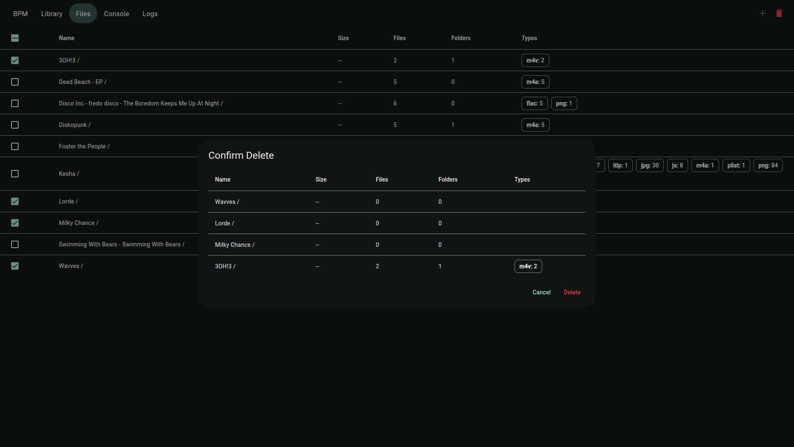

# BPM

WebUI for managing a [beets](https://github.com/beetbox/beets) library.

## Features

- Browse your music collection via a web interface.
- Import files into your library.
- Manually edit metadata during beets import.
- Response design for mobile and desktop.

## Config

### `bpm.yml`

```yaml
# Setting `soundtrack-query` to true adds the query:
# Soundtracks:
#   query: albumtype:soundtrack
#   path: Soundtracks/$album%aunique{}/$track $title
soundtrack-query: true
queries:
  <query name>:
    query: <beet query>
    path: <path template>
```

### Environment

```env
SERVE_ADDRESS=0.0.0.0:23387
BEET_CMD=beet
BEETS_HOME=/config
CONFIG_PATH=/config
IMPORT_PATH=/import
LOGS_PATH=/logs
TRACKS_PATH=/library
DEFAULT_LIBRARY_NAME=Tracks
```

## Screenshots

### Home


### Library


### Files





### Console


### Logs


### Mobile


